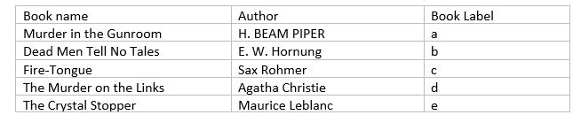
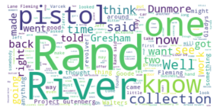

# Text Classification.

## Descriptin
Testing Different Text Classifications Algorithms on multiple different books to find best text classifier for the selected books

- We selected a group of five books from Gutenberg library,each book had a different author but all of them fall under detective and mystery stories category, the labels are used to identify the books partitions throughout the analysis and modeling.

- Then,we applyied data exploration and visualization using N-grams plots ,Uni-grams, Bi-grams and word cloud Visualizations.

- Appjying Preprocessing and Data Cleansing.
- Using Feature Engineering such as BOW , TF/IDF ,Stemming and Lemmatization
- Text Classification Models such as,

    1-	SVM

    2-  Decision tree

    3-	K nearest neighbor

     4-	Naïve Bias

    5-	10-Folds cross validation was applied for each model and folds errors were plotted.

# Conclusion

The objective of the assignment was to explore different text classification models using different feature extraction techniques. Inspect the results and choose the champion model then do further analysis to understand why the champion model was performing well on the collected books partitions corpus.
Five books in the detective and mystery stories category were selected to create the text partitions that will be used throughout the assignment. Different combinations of feature extraction techniques and classification models were used. The selected champion model was Naïve Bais classifier using BOW – with max_df equal 30 to and ngrams_range equal to (1,2)- and TF-IDF for feature extraction. The error analysis of the champion model showed that the model was performing well because it was using the character names found in the books. Also, the stemmed partitions and lemmatized partitions were used to measure their effect on the model’s accuracy but they had little to no effect on the accuracy.

